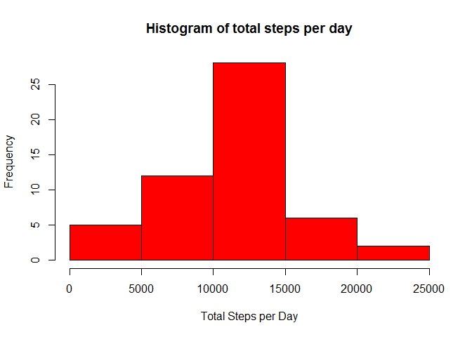
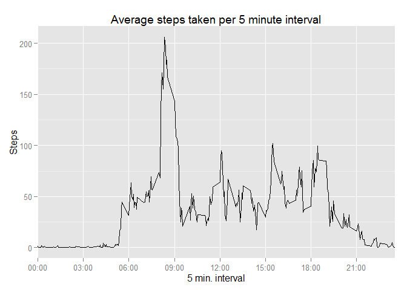
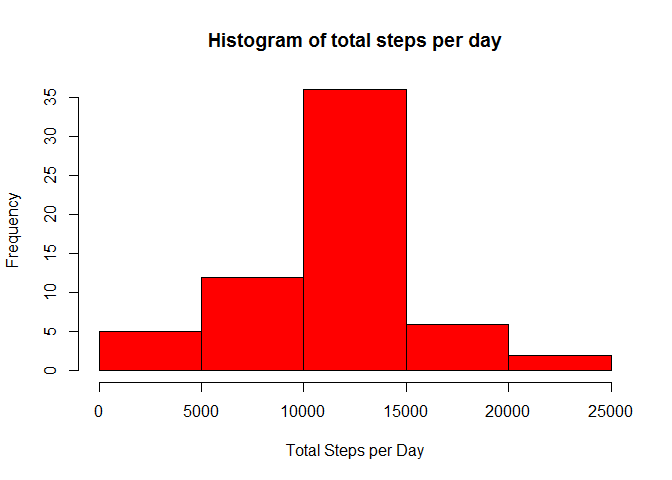
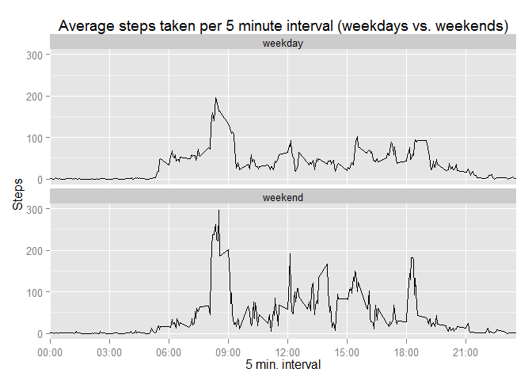

# Reproducible Research: Peer Assessment 1


## Loading and preprocessing the data

```r
library(dplyr)
```

```
## 
## Attaching package: 'dplyr'
## 
## The following object is masked from 'package:stats':
## 
##     filter
## 
## The following objects are masked from 'package:base':
## 
##     intersect, setdiff, setequal, union
```

```r
library(lubridate)
library(ggplot2)

datafile <- "activity.zip"
# Unzip the actual data if it does not exist
file <- (unzip(datafile, list = TRUE))$Name
if( !file.exists(file)) {
    unzip(datafile, file)
}
activity <- read.csv(file)

# Make the date column a date value
activity$date <- as.Date(activity$date)

# Add the day of the week
activity$wday <-  wday(activity$date)

# Remove any row with NA
activity_no_na <- na.omit(activity)
```

## What is mean total number of steps taken per day?


```r
# Get total of the steps taken per day
activity_sum <- activity_no_na %>% group_by(date)%>% summarise(steps = sum(steps))

# Create the histogram
with(activity_sum, hist(steps, xlab="Total Steps per Day", main="Histogram of total steps per day", col="red"))
```

 

```r
mean_steps <- sprintf("%0.1f", mean(activity_sum$steps))
median_steps <-sprintf("%0.1f", median(activity_sum$steps))
```

The mean total number of steps taken per day is 10766.2.

The median total number of steps taken per day is 10765.0.

## What is the average daily activity pattern?


```r
# Calculate the interval means using the data with no NAs
intervals_mean <- activity_no_na %>% group_by(interval) %>% summarise(steps = mean(steps))

# Define a scaling for the X axis - every 3 hours
scale <- seq(min(intervals_mean$interval), max(intervals_mean$interval), by=300)

# Make scale labels that look like clock time (e.g., 06:00, 09:00, etc)
scale_labs <- sub("^([[:digit:]]{2})", "\\1:", sprintf("%0.4d", scale))

g <- ggplot(intervals_mean) + 
           geom_line(aes(x = interval, y = steps)) +
           labs(title="Average steps taken per 5 minute interval", x="5 min. interval", y="Steps") +
           scale_x_discrete(breaks = scale, labels = scale_labs)
print(g)
```

 

```r
# The interval with the most steps
max_steps <- intervals_mean[intervals_mean$steps==max(intervals_mean$steps),]$interval
# Make the value look like clock time
max_steps <- sub("^([[:digit:]]{2})", "\\1:", sprintf("%0.4d", max_steps))
```

On average the time interval at 08:35 had the maximum steps.

## Imputing missing values


```r
# Number of rows with an NA
num_na <- nrow(activity[is.na(activity),])
```

There were 2304 rows in the activity data with missing values.

My strategy for filling the missing data was to use the average steps for any given 5-minute interval (intervals_means) to replace an NA value for that interval.


```r
# Copy the original data to fill in the NAs
activity2 <- activity
# Now walk through the data and replace NAs with the average steps for that interval.
for (i in which(is.na(activity2$steps))) {
    activity2$steps[i] <- with(intervals_mean, steps[interval == activity2$interval[i]])
}

# Get the new total of the steps taken per day
activity2_sum <- activity2 %>% group_by(date)%>% summarise(steps = sum(steps))
```


With NAs replaced the new activity pattern looks like this:


```r
# Create the histogram
with(activity2_sum, hist(steps, xlab="Total Steps per Day", main="Histogram of total steps per day", col="red"))
```

 

```r
mean_steps2 <- sprintf("%0.1f", mean(activity2_sum$steps))
median_steps2 <-sprintf("%0.1f", median(activity2_sum$steps))
```

The mean total number of steps taken per day is 10766.2.

The median total number of steps taken per day is 10766.2.

With my strategy for missing values the number of steps per day increased but the pattern of activity does not have any perceptible change. The mean of steps take remained the same but the median increased slightly to match the mean.

## Are there differences in activity patterns between weekdays and weekends?


```r
# Add a day type factor (weekday, weekend) to the dataset
activity2$day_type <- as.factor(ifelse(activity2$wday == 0 | activity2$wday == 6, "weekend", "weekday"))

# Calculate the means of the steps per interval
int2_mean <- activity2 %>% group_by(interval, day_type) %>% summarise(steps = mean(steps))

# Define a scaling for the X axis - every 3 hours
scale <- seq(min(intervals_mean$interval), max(intervals_mean$interval), by=300)

# Make scale labels that look like clock time (e.g., 06:00, 09:00, etc)
scale_labs <- sub("^([[:digit:]]{2})", "\\1:", sprintf("%0.4d", scale))

# Plot out the new steps means but separate by day type.
g <- ggplot(int2_mean) + 
           geom_line(aes(x = interval, y = steps)) +
           # Use facet_wrap to create a 2x2 grid of plots
           facet_wrap(~ day_type, ncol = 1) + 
           labs(title="Average steps taken per 5 minute interval (weekdays vs. weekends)", x="5 min. interval", y="Steps") +
           scale_x_discrete(breaks = scale, labels = scale_labs)
print(g)
```

 

